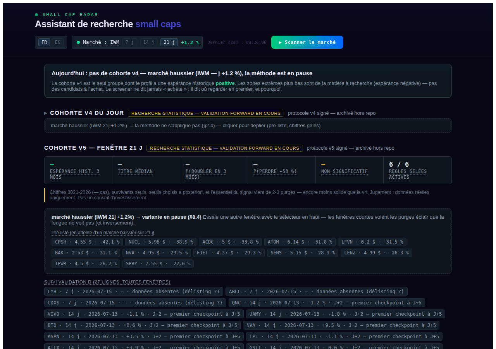
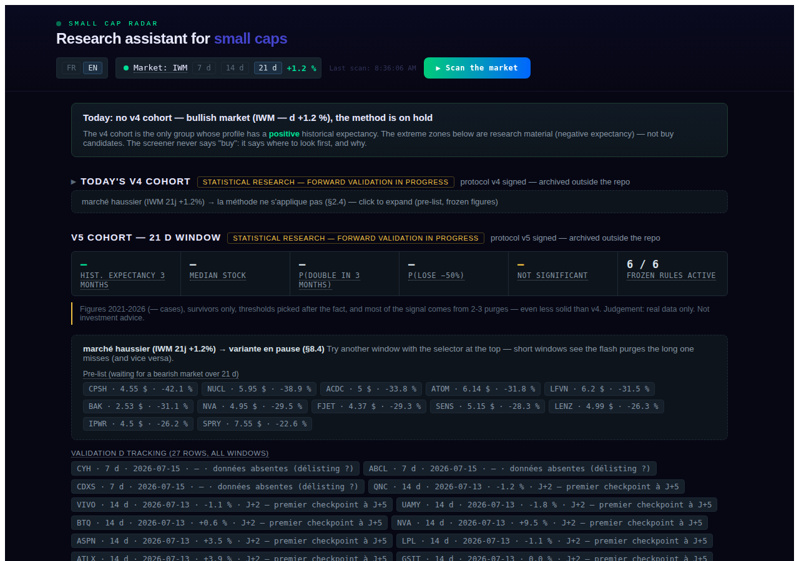

# Guide de lecture de l'interface

Ce document explique **ce qu'on voit exactement à l'écran**, étage par étage, en langage
simple. Les définitions détaillées de chaque terme sont dans [glossaire.md](glossaire.md).

Depuis l'Epic 6 S2, **tous les chiffres gelés des deux familles de purge** (seuils des
règles, bandeaux de statistiques, textes d'explication associés) sont servis à l'interface
par l'API depuis la config privée — ils n'apparaissent ni dans ce document ni dans le code
public. Les chiffres des profils Fusée/Phénix cités plus bas restent publics (post-mortem
versionné, [backtest_protocol_v2.md](backtest_protocol_v2.md)).

**Le principe général** : le screener ne dit jamais « achète ». Il dit où regarder en
premier, et pourquoi. Une seule liste affichée a un gain moyen mesuré positif (la Purge de
marché) ; tout le reste est de la matière à recherche.

Depuis l'Epic 8 S3, l'écran est nommé par ses mécanismes et non par ses numéros internes :
**Purge de marché** (*Market washout*) et **Purge silencieuse** (*Quiet washout*). Aucun
numéro de version, aucune référence de document interne n'apparaît à l'écran — c'est
vérifié par `make check-jargon`.

---

## L'en-tête

- **Toggle FR/EN** (Epic 6 S3) : toute l'interface est bilingue, textes servis par l'API
  compris (depuis l'Epic 8 S1, le backend ne renvoie que des codes de statut que le
  frontend traduit). Le bouton bascule la langue instantanément (sans rechargement) ; le
  choix est mémorisé dans le navigateur (localStorage) et survit aux rechargements.
  Défaut : français. Les chaînes vivent dans `frontend/i18n/fr.json` / `en.json` (parité
  des clés vérifiée par `make i18n-parity`, absence de chaîne en dur par
  `make check-i18n`).

  

- **Pastille « Marché : IWM »** avec son **sélecteur de fenêtre** : la variation de
  l'indice small caps (IWM) sur la fenêtre choisie (trois fenêtres déclarées à l'avance ;
  la Purge de marché garde sa propre fenêtre). **Rouge (négatif) = marché baissier → la
  méthode s'applique. Vert (positif) = elle est en pause** — c'est une règle figée, pas un
  choix d'humeur. Un badge **⚡ krach éclair** peut s'y ajouter les jours de purge violente
  (information de contexte, jamais une règle d'entrée).
- **« ▶ Scanner le marché »** : relance un scan complet de l'univers (~2 500 small/micro
  caps US).

Juste en dessous, le bandeau **« En un coup d'œil »** résume la journée en une phrase :
soit « N titres qualifiés, commencer par X », soit « aucune liste aujourd'hui, la méthode
est en pause ».

---

## Le panneau « Comment lire ce tableau de bord »

Sous le bandeau, un panneau dépliable (élément HTML natif `
` : accessible au
clavier, sans script) explique en six paragraphes, sans un seul chiffre de règle :

1. ce que l'écran est et n'est pas (jamais un conseil d'achat ou de vente) ;
2. pourquoi les règles sont **figées avant la première observation**, et pourquoi toute
   retouche remettrait le compteur d'observation à zéro ;
3. pourquoi les deux familles de purge et les deux profils ne se croisent pas ;
4. pourquoi les chiffres historiques sont mesurés **sur le passé, sociétés encore cotées
   uniquement** — donc optimistes par construction ;
5. pourquoi le seul juge est le suivi en direct ;
6. pourquoi le point de contrôle n'est **jamais** un ordre de vente.

Il est **ouvert à la première visite** puis replié ensuite (mémorisé dans le navigateur).

---

## Étage 1 — Purge de marché

### Ce que c'est

Les titres qui passent, **le jour même**, les 4 règles figées de la première famille. Un
titre qualifie si **toutes** sont vraies :

1. **Prix sous le plafond** — la zone historique des gros mouvements est bon marché.
2. **Aucune dilution en attente** — aucun dépôt au régulateur américain préparant une
   émission de nouvelles actions dans les 180 derniers jours. Si la donnée est
   indisponible, le titre est disqualifié (prudence par défaut).
3. **Chute minimale sur ~1 mois** — on achète des soldes, pas des sommets.
4. **Marché lui-même en baisse** sur la fenêtre retenue — un marché en purge brade des
   titres sans raison propre ; un titre qui s'effondre seul dans un marché haussier a de
   vraies casseroles.

### Le paragraphe d'introduction et le bloc des règles

Depuis l'Epic 8 S3, deux blocs sont affichés **en permanence**, y compris les jours sans
liste — c'est-à-dire la majorité des jours :

- un **paragraphe d'introduction** sous le titre de section, sans aucun chiffre de règle :
  ce que cette liste cherche, et pourquoi elle est vide quand le marché monte ;
- le **bloc des règles d'entrée**, monté au niveau de la section : chaque règle y porte
  son seuil (servi par l'API), **son état du jour** (remplie / bloque / en attente du
  marché / indisponible) et son explication, dépliable règle par règle. Les jours sans
  liste, une phrase nomme explicitement la règle qui bloque.

### Le bandeau de chiffres

Cinq tuiles, toutes servies par l'API : **gain moyen mesuré à 3 mois**, **fréquence des
doublements**, **fréquence des chutes de moitié**, **test de robustesse** (non significatif
— c'est LA raison d'être de l'observation en direct) et **« 4/4 règles figées actives »**.
Leurs explications longues vivent dans le bloc dépliable « En savoir plus sur cette liste »
juste en dessous, plus dans une infobulle : le survol n'existe pas au tactile.

L'encadré jaune le rappelle : chiffres mesurés sur le passé, sociétés encore cotées
uniquement, seuils choisis après coup — **un plafond d'espoir, pas une promesse**.

### Les cartes de titres

Chaque titre qualifié a une carte :

- **L'ordre d'affichage** suit la **profondeur de survente** : de combien le titre a chuté
  EN PLUS de ce que la baisse du marché explique (sa « chute propre »). Historiquement,
  plus cette part propre est profonde, meilleur a été le rebond. C'est un ordre de lecture,
  **jamais une règle d'entrée**.
- Le premier titre porte « **à étudier en premier** » et une phrase « Pourquoi lui ».
- Les **4 pastilles** en bas de carte montrent, pour ce titre, sa valeur et le seuil
  (servi par l'API). Les marges sont affichées pour information, jamais utilisées pour
  reclasser.
- Le bloc « **Avant tout achat** » : lire les dépôts récents (le catalyseur est dans les
  news, pas dans nos chiffres), vérifier l'écart achat/vente, dimensionner pour survivre
  à −50 %.

### Quand la liste est vide

« Pas de liste aujourd'hui » n'est **pas une panne** : la méthode ne regarde que pendant
les soldes générales (marché baissier). En attendant, le bloc « **en attente du marché** »
montre les titres qui passent les règles propres au titre et n'attendent que la condition
de marché — la dilution n'y est pas encore vérifiée (elle le sera le jour où ils
qualifient).

---

## Étage 1 bis — Purge silencieuse

Même mécanisme, autre signature : un titre qui s'effondre **dans l'indifférence** — sans
emballement du volume ni fuite d'argent. La même mesure est observée sur **trois fenêtres
déclarées à l'avance** et publiées ensemble, pilotées par le sélecteur de l'en-tête ; la
**fenêtre de référence** (désignée d'avance pour le jugement) est signalée à côté du titre
de section.

Six règles par titre (prix, dilution, profondeur de chute sur la fenêtre, marché baissier
sur la MÊME fenêtre, flux d'argent, volume calme). Elles apparaissent, comme pour la Purge
de marché, dans le bloc des règles avec leur état du jour, et chaque carte affiche ses six
pastilles avec les seuils servis par l'API. Le journal de suivi enregistre chaque entrée
(fenêtre, date, prix).

---

## Étage 2 — Suivi des titres qualifiés

Le journal de tous les titres enregistrés depuis le 6 juillet 2026, une section par
famille (Purge de marché, puis Purge silencieuse avec sa colonne de fenêtre). Chaque
section annonce d'abord son **calendrier d'observation** — jour du point de contrôle,
horizon de clôture, servis par l'API — puis range ses lignes en **trois blocs** :

- **En observation** : le panier vivant, toujours déployé.
- **Clôturées** : les lignes dont la fenêtre est échue, repliées par défaut (un
  `
` natif, aucun script).
- **Sans données de prix** : retrait de la cote possible ; ces lignes restent affichées
  avec leur code dédié et n'entrent dans aucun des deux autres blocs.

Colonnes :

- **Entré le / prix d'entrée / aujourd'hui** : la performance réelle depuis la
  qualification (J+n).
- **Cycle de vie** : la frise entrée → point de contrôle (trait jaune) → clôture, remplie
  jusqu'à la position du jour, avec le nombre de séances restantes. Le point de contrôle
  est une lecture intermédiaire mesurée quelques séances après l'entrée (jour et seuil
  servis par l'API) : au-dessus du seuil, les fréquences historiques penchaient nettement
  mieux ; en dessous, l'inverse — mais une part substantielle des plus fortes hausses était
  encore négative à ce stade.
- **Position** : où en est le titre (au-dessus / sous le seuil / doublement / chute de
  moitié / fenêtre close).
- **Ce que disaient les cas passés** : la traduction chiffrée de la position (servie par
  l'API).

**Le point de contrôle n'est pas une sortie**, et c'est écrit en toutes lettres au-dessus
du tableau : un titre passé sous le seuil reste en observation jusqu'à la clôture. Couper
les retardataires en cours de route détruit le rendement mesuré de l'ensemble, parce que
les stops coupent la réversion.

Cet étage est le cœur de l'**observation en direct** : c'est lui qui jugera la méthode,
selon des critères écrits à l'avance.

---

## Étage 2 bis — Résultats réels des sélections

Le résultat, compartiment par compartiment, de tout ce qui a réellement été sélectionné
depuis l'origine — servi par `GET /api/performance`, calculé depuis le premier scan et
affiché ici pour la première fois. Chaque titre y entre le jour de sa première apparition,
au prix de ce jour-là, et n'en sort plus : **aucune ligne n'est réécrite après coup**.
C'est ce qui distingue ce tableau des chiffres mesurés sur le passé affichés plus haut,
où les sociétés disparues ont été effacées des données.

Une ligne par compartiment — ensemble, 🚀 Fusée, 🔥 Phénix, et « enregistrés avant les
profils » quand il en reste — avec le nombre de titres suivis, le gain moyen, le titre
médian, l'écart contre l'indice et les décomptes de hausses de moitié et de doublements.
Un même titre peut porter les deux profils : les compartiments ne s'additionnent pas.

Trois précautions de lecture sont affichées en permanence sous le tableau, y compris les
jours où il est vide :

- **Ce qui se tranchera vite** : le gain moyen. Quelques dizaines de lignes suffisent à
  voir de quel côté penche l'ensemble par rapport à l'indice.
- **Ce qui ne se tranchera pas avant des années** : la fréquence des doublements. Le taux
  de base est de l'ordre d'un titre sur cinquante par trimestre ; démontrer qu'un
  compartiment fait mieux demande des centaines de lignes closes.
- **Le verdict déjà rendu** : l'hypothèse Fusée / Phénix a été testée et réfutée en
  juillet 2026. Ce tableau ne la rejuge pas ; il mesure ce qui a été sélectionné, et c'est
  le seul résultat qui pourrait un jour la contredire.

Si le suivi est indisponible (serveur, réseau), la section le dit et **le reste de la page
reste à jour** : l'appel est isolé.

---

## Étage 3 — Zones extrêmes (🔥 Phénix · 🚀 Fusée)

### Ce que c'est

Les titres qui correspondent aux deux profils d'une hypothèse antérieure :

- **🚀 Fusée** : momentum extrême — l'action déjà brûlante.
- **🔥 Phénix** : action massacrée (loin de son plus-haut annuel), volatilité comprimée,
  premiers signes de stabilisation.

Un paragraphe d'introduction permanent explique d'où viennent ces profils, ce qu'on en a
mesuré et pourquoi ils restent affichés.

### Pourquoi « hypothèse testée et réfutée en juillet 2026 » sur chaque badge

Les deux profils ont été testés une fois pour toutes, avec leurs critères de succès écrits
d'avance, et ont **échoué** :

- **Fusée** : double aussi souvent qu'un titre au hasard (1,03×) — aucun avantage.
  Gain moyen : −9,6 %.
- **Phénix** : les doublements y sont bien 4,6× plus fréquents… mais les chutes de moitié
  2,3× aussi, et le gain moyen net est de **−11 %**.

Le cartouche remplace l'ancien marqueur « non validé », qui laissait croire à un test
encore en attente alors que le verdict est rendu. Les profils restent affichés parce
qu'ils sélectionnent le vivier montré ici et qu'ils sont une matière de recherche humaine —
jamais une liste d'achat, et jamais non plus un signal d'exclusion inversé.

### Le dossier de risque

Sur chaque carte : les drapeaux factuels tirés des dépôts officiels — **détresse déclarée**
(doute de l'auditeur sur la survie à douze mois, retard de dépôt : volatilité extrême, sans
direction), **dilution en attente** (seul drapeau clairement défavorable) — et le bouton
**« Analyser avec Claude »** qui lit le dossier et résume.

---

## Ce que l'écran ne dit jamais

- « Achète » ou « vends » — aucune ligne de l'interface n'est un conseil
  d'investissement.
- Une promesse de rendement : tout chiffre historique est un plafond d'espoir (sociétés
  encore cotées uniquement, seuils choisis après coup), et le test de robustesse affiché
  rappelle que même un gain moyen positif peut être du bruit. Le juge de paix est
  l'observation en direct.
